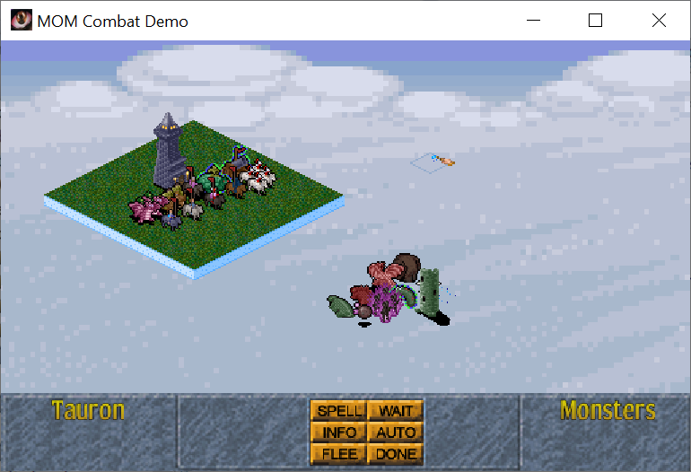
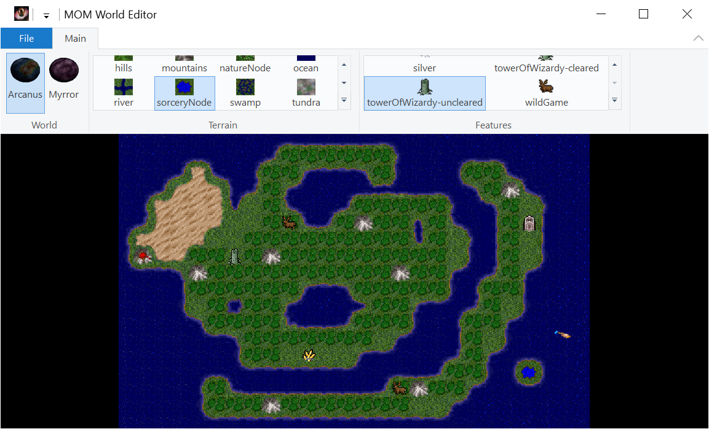
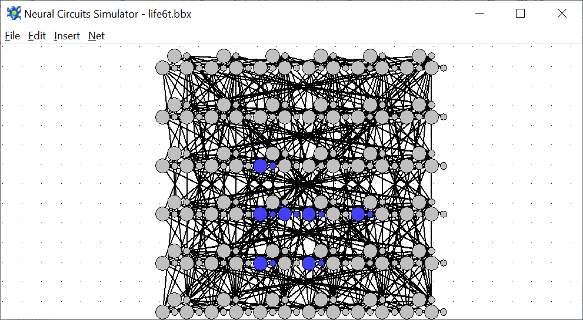

# Mirror from Simbey's SVN Repository
## Inside this GitHub repository, you will find:
* Master of Magic Demo Projects
* Neural Circuits Simulator
* Some of Simbey's common C++ library code and templates
## Screenshots:

