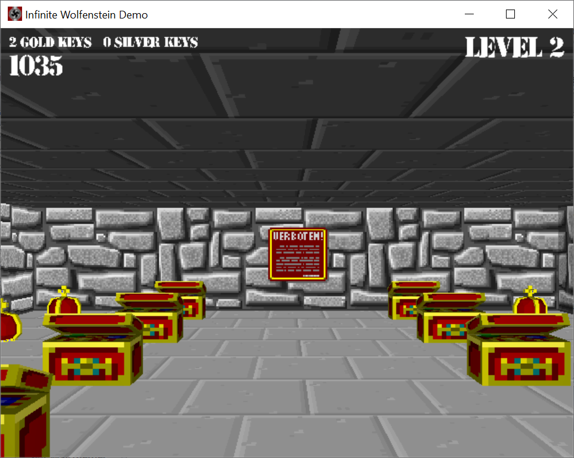
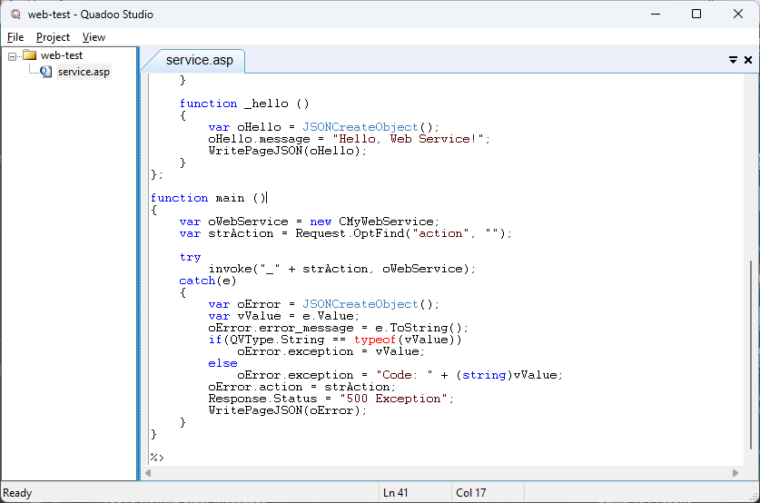
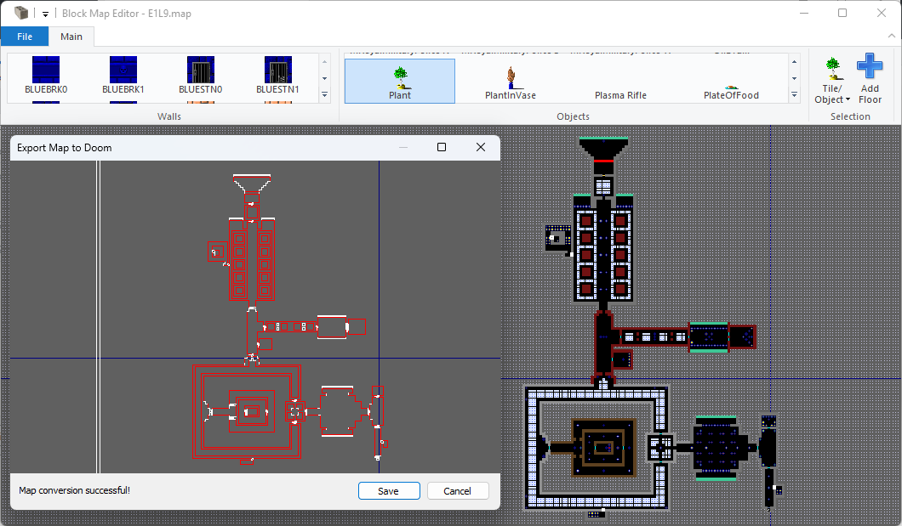

# Mirror from Simbey's SVN Repository
## Inside this GitHub repository, you will find:
* [Master of Magic Demo Projects](samples/MOMPrototypes)
* [Neural Circuits Simulator](desktop/NeuralCircuits)
* [Infinite Wolfenstein Demo](desktop/InfiniteWolfenstein)
* [Quadoo Studio](desktop/QuadooStudio)
* [Some of Simbey's common C++ library code and templates](shared/library)
## Screenshots:
### Master of Magic Combat Demo

### Master of Magic World Editor (Overland Rendering) Demo

### Neural Circuits Desktop Application

### Infinite Wolfenstein Desktop Demo

### Quadoo Studio ###

### Block Map Editor ###

